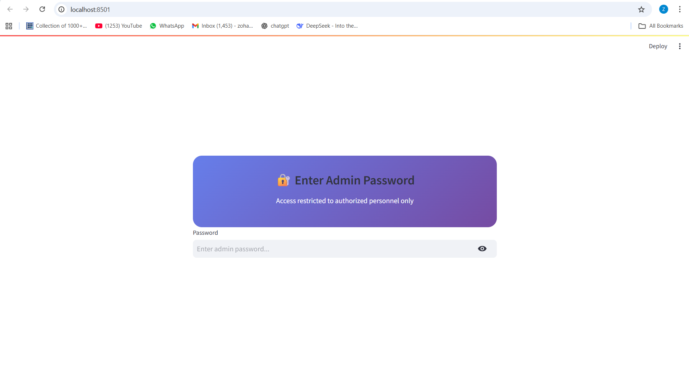
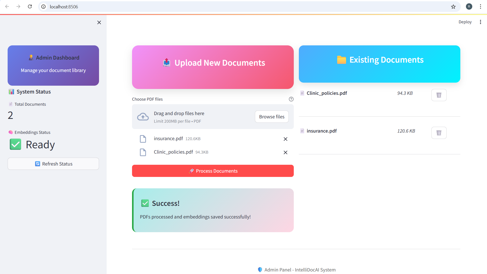
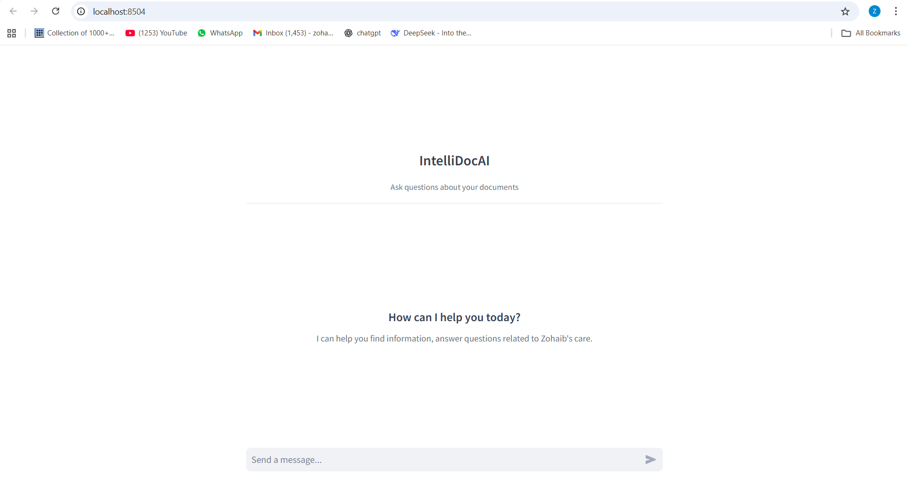
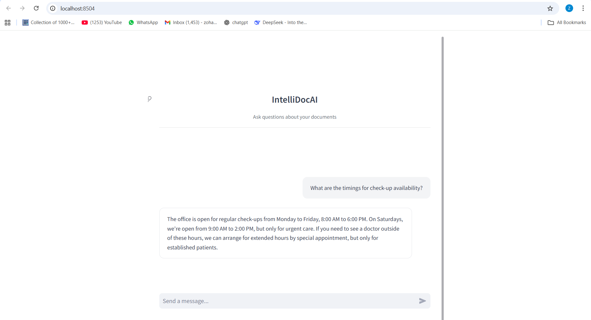

#  IntelliDocAI - Enterprise Document Intelligence System

> **Advanced Multi-Document AI Assistant with Role-Based Access Control**

IntelliDocAI is a sophisticated document intelligence platform that transforms how organizations interact with their document libraries. Unlike traditional single-document chat systems, IntelliDocAI provides enterprise-grade features including administrative document management, persistent storage, and multi-document querying capabilities.

##  System Flow


##  Key Features

###  **Administrative Control**
- **Secure Admin Panel** with password-protected access
- **Bulk Document Processing** - Upload and process multiple PDFs simultaneously  
- **Document Library Management** - View, organize, and delete documents
- **Persistent Storage** - Documents remain available across sessions

###  **Intelligent Chat Interface**
- **Multi-Document Querying** - Ask questions across your entire document library
- **Natural Conversation Flow** - Clean, human-like responses without technical jargon
- **Context-Aware Responses** - Maintains conversation history and context
- **Real-Time Processing** - Instant responses with thinking indicators


##  What Makes IntelliDocAI Different

| Feature | Traditional ChatPDF | IntelliDocAI |
|---------|-------------------|--------------|
| **Document Scope** | Single document per session | Multi-document library |
| **Access Control** | Open access | Role-based admin/user system |
| **Data Persistence** | Session-based | Permanent document storage |
| **Management** | No document management | Full CRUD operations |
| **Enterprise Ready** | Personal use | Organization-wide deployment |

---
##  Interface
###  Admin Interface



###  User Interface





##  Installation & Setup

###  Prerequisites
- Python **3.8+**
- A **Groq API Key** ([Get yours here](https://console.groq.com))

---

### ⚡ Quick Start

1. **Clone the Repository**
   ```bash
   git clone https://github.com/yourusername/intellidoc_ai.git
   cd intellidoc_ai

2. **Install Dependencies**
   ```bash
   pip install -r requirements.txt
   ```

3. **Configure Environment**
   ```bash
   # Create .env file
   echo "GROQ_API_KEY=your_groq_api_key_here" > .env
   ```

4. **Launch Admin Panel**
   ```bash
   $env:PYTHONPATH = "."
   streamlit run admin_app/app.py --server.port 8501
   ```

5. **Launch User Interface** (in new terminal)
   ```bash
   $env:PYTHONPATH = "."
   streamlit run user_app/app.py --server.port 8502
   ```

### Windows Users
```powershell
# Use the provided PowerShell script
   $env:PYTHONPATH = "."
   streamlit run user_app/app.py --server.port 8502

```

## 📖 Usage Guide

### 🛡️ Administrator Workflow

1. **Access Admin Panel**
   - Navigate to `http://localhost:8501`
   - Enter admin password (default: **`admin123`**)

2. **Upload Documents**
   - Select multiple PDF files
   - Click "Process Documents"
   - Wait for embedding generation

3. **Manage Library**
   - View all uploaded documents
   - Delete unwanted files
   - Monitor processing status

### 👤 User Workflow

1. **Access Chat Interface**
   - Navigate to `http://localhost:8502`
   - Start asking questions immediately

2. **Interactive Conversations**
   - Ask questions about any uploaded document
   - Get contextual, natural responses
   - Build on previous conversations

## 🔧 Technical Architecture

### Core Components

- **🧠 LangChain Integration**: Advanced RAG (Retrieval-Augmented Generation)
- **⚡ Groq LLM**: High-speed inference with Llama-3-70B model
- **🔍 FAISS Vector Store**: Efficient similarity search and clustering
- **📄 PyMuPDF**: Robust PDF processing and text extraction
- **🎨 Streamlit**: Modern web application framework

### AI Pipeline

```
PDF Upload → Text Extraction → Chunking → Embedding → Vector Storage → Query Processing → LLM Response
```

### For now, I’ve uploaded a basic sample dataset, for which embeddings have also been created.